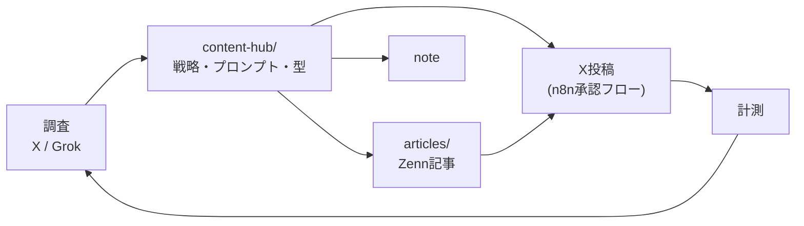

# content-hub — THINK YOU LAB 発信のマスターソース

[](https://github.com/thinkyou0714/zenn-content/actions/workflows/ci.yml)

**AI副業・個人開発の発信活動における、すべての文章生成の大本(マスターソース)リポジトリです。**
Zenn記事のソースに加え、X・note等の全チャネル向けの戦略・文体・生成プロンプト・ベストプラクティスを一元管理します。

> 📝 リポジトリ名について: 役割が「Zenn記事置き場」から「全発信のハブ」に拡張されたため、
> リポジトリ名を `zenn-content` から **`content-hub`** へ変更することを推奨します。
> 変更手順は [content-hub/workflows/human-tasks.md](content-hub/workflows/human-tasks.md) の初期セットアップを参照してください。

## 全体像



| ディレクトリ | 役割 |
|---|---|
| [content-hub/](content-hub/) | **文章生成のマスターソース**(戦略 / 文体 / プロンプト / テンプレ / ベストプラクティス100 / ワークフロー / チェックリスト) |
| [articles/](articles/) | Zenn記事(Markdown + frontmatter) |
| [.github/workflows/](.github/workflows/) | CI(lint)と予約公開の自動化 |

まず読む: [content-hub/README.md](content-hub/README.md)(ハブの使い方) / [content-hub/workflows/human-tasks.md](content-hub/workflows/human-tasks.md)(人間とAIの役割分担)

## 記事一覧

| 記事 | テーマ | slug |
|---|---|---|
| [Claude Code hooksを47本実装した話](articles/claude-code-hooks-47.md) | AIへの自動指示の設計 | `claude-code-hooks-47` |
| [n8n × Claude Code で55本のWFを動かしている](articles/n8n-claudecode-automation-overview.md) | 副業自動化システムの全体像 | `n8n-claudecode-automation-overview` |
| [ObsidianをAIの第二の脳にした](articles/obsidian-n8n-ai-pipeline.md) | ナレッジ自動管理システム | `obsidian-n8n-ai-pipeline` |
| [記事のOGP・図解・サムネを全部AIに作らせた](articles/ai-image-pipeline.md)(ドラフト) | 画像生成パイプライン | `ai-image-pipeline` |

## ローカルプレビュー

```bash
npm install
npm run preview   # zenn preview（http://localhost:8000）
```

## 品質チェック(Lint)

PR では CI([`ci.yml`](.github/workflows/ci.yml))が以下を自動実行します。ローカルでも同じチェックを実行できます。

```bash
npm run lint        # 下記すべてをまとめて実行
npm run lint:md     # markdownlint（articles/ + content-hub/ + README）
npm run lint:text   # textlint（日本語の客観的な誤り検出）
npm run lint:zenn   # zenn list:articles（frontmatter 検証）
```

textlint は一人称・だ体・口語の文体を尊重し、スタイル指摘ではなく「ら抜き・二重否定・半角カナ・冗長表現・誤用」など客観的な誤りのみを検出する設定です([`.textlintrc.json`](.textlintrc.json))。

## 予約公開の仕組み

各記事の frontmatter に `publish_scheduled`(公開予定日時)を設定すると、
GitHub Actions([`x-color/zenn-post-scheduler`](https://github.com/x-color/zenn-post-scheduler))が
その時刻を過ぎた記事の `published` を自動で `true` に切り替え、コミット・プッシュします。

- 実行枠は **09:00 JST 公開運用**に合わせ、`00:00-00:45 UTC`(= `09:00-09:45 JST`)の 15 分間隔のみ。
- 即時公開・手動再実行が必要な場合は Actions タブから `workflow_dispatch` で起動できます。

### frontmatter の例

```yaml
---
title: 記事タイトル
emoji: 🪝
type: tech            # tech / idea
topics: [claudecode, automation]   # 最大 5 個
published: false      # 公開時に true（スケジューラが自動で切替）
publish_scheduled: '2026-05-17T09:00:00+09:00'   # 予約公開日時
---
```

## ライセンス

[MIT](LICENSE) © 2026 thinkyou0714
