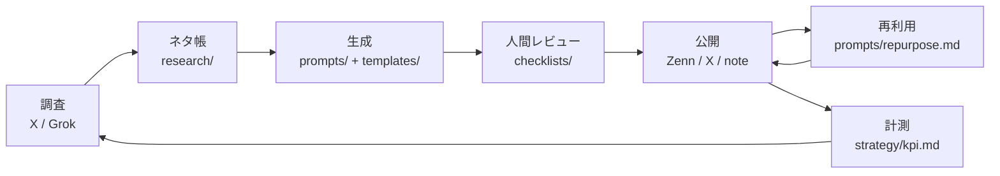

# content-hub — 全文章生成の大本(マスターソース)

このディレクトリは、**AI副業・個人開発のすばらしさを発信する活動における、すべての文章生成の起点**として機能する。
Zenn記事・X投稿・note・その他どのチャネル向けの文章も、ここにある「戦略・文体・プロンプト・型」から生成する。

## 設計思想

- **Single Source of Truth**: 発信のミッション・ペルソナ・文体・型をリポジトリで一元管理する。AIに文章を作らせるとき、このハブを読ませれば毎回同じ品質・同じ人格で出力される
- **調査はXとGrokが起点**: トレンドの鮮度と「日本人の心の動かし方」はX(とGrok)から学ぶ。手順は [research/trend-research.md](research/trend-research.md)
- **人間は判断と体験、AIは調査と執筆**: 役割の線引きは [workflows/human-tasks.md](workflows/human-tasks.md) に定義する

## 全体フロー

## ディレクトリ構成

| ディレクトリ | 役割 |
|---|---|
| [strategy/](strategy/) | ミッション・ペルソナ・コンテンツの柱・チャネル戦略・KPI |
| [voice/](voice/) | 文体ガイド(全チャネル共通の「声」の定義) |
| [research/](research/) | X/Grokトレンド調査の手順書とネタ帳 |
| [prompts/](prompts/) | 各チャネル向け文章生成プロンプト(AIへの指示書) |
| [templates/](templates/) | 記事・投稿の構造テンプレート |
| [best-practices/](best-practices/) | ベストプラクティス100(10カテゴリ x 10個) |
| [workflows/](workflows/) | コンテンツパイプライン・週次ルーチン・人間タスク定義 |
| [checklists/](checklists/) | 公開前チェックリスト(Zenn / X / 月次レビュー) |

## 使い方(AIエージェントへの典型的な依頼)

このリポジトリを開いた Claude Code / AIエージェントは、生成依頼を受けたらまず該当プロンプトを読むこと。

| やりたいこと | 読むファイル |
|---|---|
| Zenn記事を書く | `prompts/zenn-article.md` + `voice/style-guide.md` + `templates/zenn-article-template.md` |
| X投稿を作る | `prompts/x-single-post.md` または `prompts/x-thread.md` |
| 記事をXに展開する | `prompts/repurpose.md` |
| 有料noteを書く | `prompts/note-paid-article.md` |
| ネタを探す | `research/trend-research.md` のGrokプロンプトを人間に依頼 |
| 公開前チェック | `checklists/` の該当チェックリスト |

## 運用ルール

1. 文体・戦略に迷ったら、個別に判断せずこのハブの該当ファイルを更新してから生成する(場当たり対応の禁止)
2. プロンプトの改善は直接ファイルを編集し、コミットメッセージに改善理由を残す(プロンプトのバージョン管理)
3. 公開物に含む実績数字・体験談は人間が提供したものだけを使う(AIによる捏造の禁止 → [workflows/human-tasks.md](workflows/human-tasks.md))
4. ベストプラクティスは固定資産ではない。月次レビュー([checklists/monthly-review.md](checklists/monthly-review.md))で入れ替える
