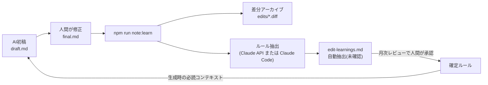

# memory — 編集学習ループ(人間の修正をAIが記憶する仕組み)

人間がAI初稿に加えた修正を自動で蓄積し、次回の生成に反映するためのディレクトリ。
「同じ修正を二度させない」ことで、レビュー時間を回を追うごとに減らす。

## 仕組み

## ファイル構成

| パス | 役割 |
|---|---|
| [edit-learnings.md](edit-learnings.md) | 蓄積されたルール本体。**全チャネルの生成時に必読コンテキストへ含める** |
| `edits/*.diff` | draft と final の生差分(監査・再抽出用のアーカイブ) |
| `edits/PENDING.md` | APIキーが無い環境で溜まった未抽出キュー |

## 運用ルール

1. note記事の人間レビューが終わったら、完成稿を `final.md` に保存して
   `npm run note:learn -- <slug>` を実行する(これだけで記憶される)
2. 自動抽出されたルールは「未確認」扱い。月次レビューで人間が確認し、
   有効なものを「確定ルール」へ昇格、外れたものは削除する
3. 確定ルールが10件を超えたら、恒久的なものは
   [../voice/style-guide.md](../voice/style-guide.md) や各プロンプト本体へ昇格させ、
   このファイルは「最近の学び」に保つ
4. ルールの抽出基準は [../prompts/edit-learning.md](../prompts/edit-learning.md) を参照
5. `edit-learnings.md` と `edits/` は機械が書き込むため文体lint(textlint)の対象外
   (`.textlintignore`)。内容の妥当性は月次レビューの人間確認で担保する
