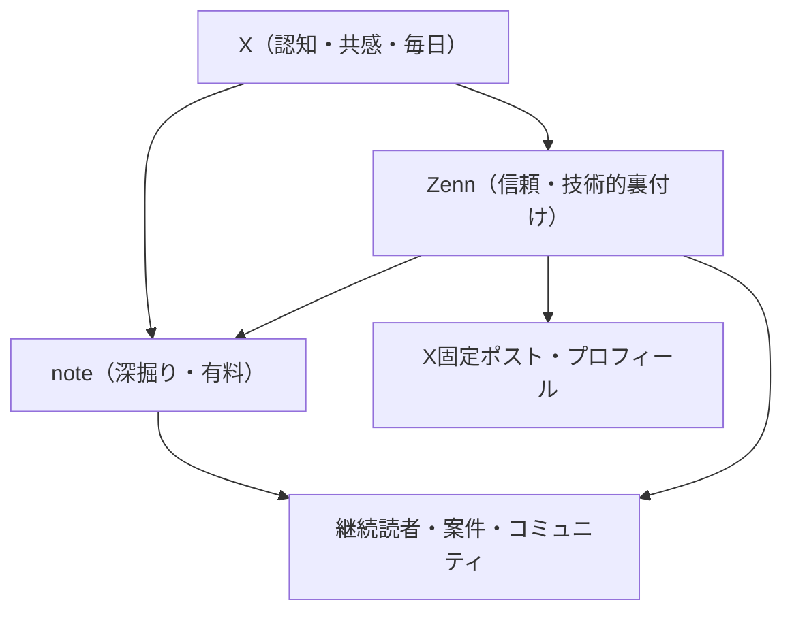

# チャネル戦略とファネル設計

各チャネルの役割を固定し、1つのネタを複数チャネルに展開する前提で生成する。
展開の実務は [prompts/repurpose.md](../prompts/repurpose.md) を使う。

## ファネル全体像

- **X = 入口**: 毎日接触して認知と共感を作る。ここでの反応がネタの需要検証になる
- **Zenn = 信頼の担保**: 「この人は本当に動かしている」を証明する場所。検索・トレンドからの新規流入も担う
- **note = 収益化の受け皿**: 無料で価値を示したテーマの「完全版・時短版」を有料で置く

## チャネル別運用ルール

### X(最優先チャネル)

| 項目 | ルール |
|---|---|
| 頻度 | 平日1〜3投稿(下書きはAI生成 → 人間が承認。既存のn8n承認フローを使う) |
| 型 | [templates/x-post-patterns.md](../templates/x-post-patterns.md) の型から選ぶ |
| リンク | 外部リンクは本文ではなくリプライ欄に置く(リーチ低下対策の定石) |
| 返信 | 自分の投稿への意味あるリプライには原則24時間以内に人間が返す |
| 検証 | 記事化前のテーマは必ずXで先出しして反応を測る(先出し → 反応良 → 記事化) |

### Zenn

| 項目 | ルール |
|---|---|
| 頻度 | 月2〜4本。数より「1本あたりの証拠の濃さ」を優先 |
| 型 | [templates/zenn-article-template.md](../templates/zenn-article-template.md) 準拠(TL;DR → 検証環境 → 対象読者 → 本文) |
| 公開 | frontmatter の `publish_scheduled` で 09:00 JST 予約公開(既存の自動化に乗せる) |
| 公開後 | 当日中にX告知ポスト(記事の一番おいしい一文+リプ欄にリンク) |

### note(有料)

| 項目 | ルール |
|---|---|
| 頻度 | 月0〜1本。乱発しない |
| 条件 | Zenn/Xで無料公開して反応が実証されたテーマのみ有料化する |
| 価格 | 深掘り・テンプレ・時短の対価として設定。「稼げる情報」としては売らない |
| 表示 | 収益・実績を書くときは期間・コスト・前提を必ず併記(景表法/ステマ規制対応) |

## 新チャネルの追加基準

以下を満たすまで新チャネル(YouTube、Podcast等)には手を出さない。

1. 既存3チャネルの週次ルーチンが人間タスク週5時間以内で回っている
2. X フォロワーまたは Zenn フォロワーが明確な成長トレンドにある
3. 新チャネル向けの生成プロンプトをこのハブに先に整備できる
