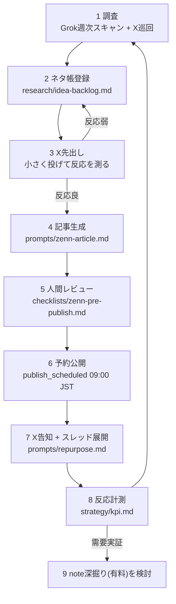

# コンテンツパイプライン(ネタ → 公開 → 再利用)

1つのネタが生まれてから複数チャネルで使い切られるまでの標準工程。
各工程の担当(人間/AI)は [human-tasks.md](human-tasks.md) の定義に従う。

## パイプライン全体

## 工程別の詳細

### 1-2. 調査 → ネタ帳(週次)

- AI: Grok回答の整形、ネタ帳転記、柱・ペルソナのタグ付け
- 人間: Grokへの実行(20分)、元ポストの目視確認、採用/保留の判断
- 完了条件: ネタ帳に「柱・ペルソナ・出典・鮮度」が埋まった行が追加されている

### 3. X先出し(需要検証)

- AI: ネタを `prompts/x-single-post.md` で投稿化(型は複数案出す)
- 人間: 承認して投稿。48時間の反応を確認
- 判断基準: プロフィールクリック・ブックマーク・リプライが平常時を上回れば「反応良」

### 4-5. 記事生成 → レビュー

- AI: `prompts/zenn-article.md` + 文体ガイド + テンプレで初稿生成 → セルフリライト(AIっぽさ除去) → lint実行
- 人間: 実物の数字・スクショ・体験談を差し込み、チェックリストで最終確認(30〜60分)
- **鉄則**: 体験・数字のプレースホルダー(`【人間: ○○を記入】`)をAIが勝手に埋めない

### 6-7. 公開 → 展開

- AI: frontmatter整備(`publish_scheduled` 09:00 JST)、公開当日のX告知文・翌週のスレッド展開案を生成
- 人間: 公開承認、告知投稿の承認、リプライ対応
- 展開の基本セット(1記事から最低5コンテンツ):
  1. 公開当日: 告知ポスト(記事の一番おいしい一文 + リンクはリプ欄)
  2. 2〜3日後: 記事の核心を1枚図解 or 箇条書きでポスト
  3. 1週間後: 記事本文をXスレッドに再構成
  4. 2週間後: 記事にまつわる失敗談・裏話ポスト
  5. 需要があれば: note深掘り版(有料)

### 8-9. 計測 → 次サイクル

- AI: 週次で数字を整理、月次で「伸びた型/滑った型」レポート
- 人間: 月次レビュー([../checklists/monthly-review.md](../checklists/monthly-review.md))で戦略判断

## リードタイムの目安

| 工程 | 所要 |
|---|---|
| ネタ → X先出し | 2〜3日 |
| 反応確認 → 記事公開 | 1〜2週間(実物準備に依存) |
| 記事 → 展開出し切り | 公開後2週間 |
| 1ネタの寿命 | 約1ヶ月で使い切り、計測結果を次ネタへ |
