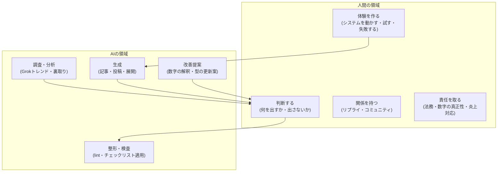

# 人間タスク定義 — AIに任せる仕事と、人間に残る仕事

このハブの運用で「人間がやること」を明文化する。
結論から言うと、**人間の仕事は「書くこと」から「体験を作ること・判断すること・関係を持つこと」に移る**。
執筆・調査・展開・チェックの大部分はAI(Claude Code + n8n + Grok)が担う。

## 役割分担の全体像

## 人間にしかできない7つのタスク

| # | タスク | なぜ人間か | 目安時間 |
|---|---|---|---|
| HT-1 | **体験と実数の提供** — システムを実際に動かし、スクショ・数字・失敗談を渡す | 発信の信頼の源泉。AIが捏造した瞬間にこの発信は死ぬ | 本業(副業活動そのもの) |
| HT-2 | **公開判断(承認)** — 生成物を出す/出さない/直すの最終決定 | 名前と責任は人間のもの。プラットフォーム規約・景表法上も運用者責任 | 1投稿1〜3分、記事30分 |
| HT-3 | **X上の対人コミュニケーション** — リプライ返し、他アカウントとの交流 | AI自動返信は規約・信頼の両面でリスク。関係資産は人間にしか作れない | 毎日15分 |
| HT-4 | **トレンドの目視確認** — Grok回答の元ポストをXで実際に見る、肌感の獲得 | Grokのハルシネーション対策+「心の動かし方」は目視でしか身につかない | 毎日10分 |
| HT-5 | **アカウント・金銭・契約の管理** — 各サービスのアカウント、支払い、収益受取、税務 | 法的主体は人間。API鍵や認証情報の管理も含む | 月1時間 |
| HT-6 | **戦略の意思決定** — 柱の変更、価格設定、新チャネル参入、撤退 | 目標とリスク許容度は本人にしか決められない(AIは選択肢を出すまで) | 月次レビュー時 |
| HT-7 | **危機対応** — 炎上・誤情報指摘・権利者連絡への一次対応 | 初動の謝罪・訂正判断を誤ると被害が拡大する。テンプレ対応は逆効果 | 発生時のみ |

## AIに完全委任するタスク

- Grok/Web調査の実行・整形・ネタ帳への転記(人間はプロンプトを投げて結果を確認するだけ)
- 記事・X投稿・note原稿の初稿生成と、文体ガイド適用・AIっぽさ除去のセルフリライト
- Zenn→X→note のチャネル展開(リパーパス)生成
- lint・チェックリストの機械的検査、frontmatter整備、予約公開設定
- 週次・月次の数字整理と「伸びた型/滑った型」の分析レポート
- このハブ自体のメンテナンス提案(プロンプト改善案、ベストプラクティス更新案)

## 人間の週間タイムバジェット(目安: 週5時間以内)

| 曜日 | タスク | 時間 |
|---|---|---|
| 毎日 | X巡回・目視確認(HT-4) + リプライ(HT-3) + 投稿承認(HT-2) | 30分/日 |
| 週初 | Grok週次スキャンの実行とネタ選定(HT-4→HT-2) | 30分 |
| 週末 | 記事レビュー・公開判断(HT-2)、週次振り返り記入 | 60分 |
| 随時 | 体験づくり=システム開発・実験(HT-1) | 趣味と実益を兼ねた本体活動 |

## 初期セットアップの人間タスク(一度だけ)

このハブの運用開始時に、人間にしかできない一度きりの作業。

| # | タスク | 手順 |
|---|---|---|
| SETUP-1 | **リポジトリ名の変更**(推奨: `zenn-content` → `content-hub`) | GitHub → Settings → General → Repository name を変更。旧URLは自動リダイレクトされるが、次の2点を確認する: (1) Zennのダッシュボード → GitHub連携でリポジトリ連携が生きているか(切れていたら再連携)、(2) ローカルクローンで `git remote set-url origin <新URL>` を実行。README冒頭のバッジURLも新名称に更新する |
| SETUP-2 | X Premium / Grok の利用環境確認 | Grokの週次スキャン([../research/trend-research.md](../research/trend-research.md))を回せるプラン(DeepSearchの回数制限)を確認する |
| SETUP-3 | n8n承認フローとハブの接続 | X投稿生成のプロンプトを [../prompts/x-single-post.md](../prompts/x-single-post.md) 参照に差し替え、Slack承認キューの運用を [weekly-routine.md](weekly-routine.md) に合わせる |
| SETUP-4 | プロフィール・固定ポストの更新 | ポジション定義([../strategy/mission.md](../strategy/mission.md))に沿ってXプロフィールを設計(BP-028) |

## 移行の考え方(Before → After)

| 作業 | Before(全部人間) | After(このハブ運用) |
|---|---|---|
| ネタ探し | 数時間さまよう | Grokプロンプト1本+目視10分 |
| 記事執筆 | 1本8〜20時間 | AI初稿+人間レビュー1〜2時間 |
| X投稿 | 都度考えて消耗 | 承認キューから1〜3分/本 |
| 多チャネル展開 | やらない(手が回らない) | リパーパス生成を承認するだけ |
| 分析 | やらない | AIレポートを月次で読む |

**注意**: 人間タスクを削りすぎない。特に HT-1(体験)と HT-3(対人)を削ると、
コンテンツの独自性と拡散の起点が同時に失われ、「AI量産アカウント」に堕ちる。
ここが競合との最大の差別化点であり、この運用の生命線である。
