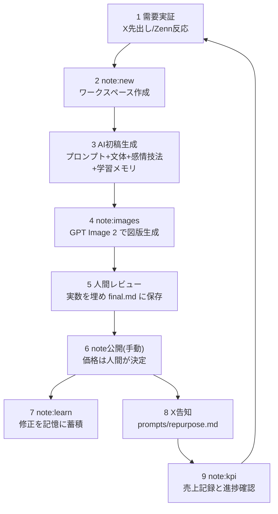

# note収益化システム — 月10万円を安定させる仕組み

noteで月10万円の収益を継続する運用システムの設計書。
これは**設計目標であり、収益の保証ではない**(数字はすべて逆算のための仮定値)。
チャネル戦略上のnoteの位置づけは [../strategy/channels.md](../strategy/channels.md)、
noteの記事構造は [../templates/note-article-template.md](../templates/note-article-template.md) を参照。

## 全体像 — 3つの装置で回す

| 装置 | 何をするか | 実体 |
|---|---|---|
| 1. 心を動かす原稿の量産線 | 需要実証済みテーマから、感情設計された原稿をAIが生成 | [../prompts/note-paid-article.md](../prompts/note-paid-article.md) + [../voice/emotional-writing.md](../voice/emotional-writing.md) |
| 2. 画像の自動組み込み | 原稿内のディレクティブから GPT Image 2 で図版を生成・埋め込み | `npm run note:images` |
| 3. 編集学習ループ | 人間の修正を自動で記憶し、次回の初稿品質を上げる | `npm run note:learn` + [../memory/](../memory/README.md) |

人間の役割は「体験の提供・修正・価格決定・公開判断」に集中する
([human-tasks.md](human-tasks.md) HT-1 / HT-2 / HT-6)。

## 収益モデルの数理(逆算表)

月10万円 = 単価 × 月間販売数。単一記事で狙わず、**ストック(記事本数)× 各記事の月販**で積み上げる。

| 単価 | 月10万円に必要な販売数 | 現実的な形 |
|---|---|---|
| 1,000円 | 100部/月 | ストック5本 × 各20部 |
| 2,980円 | 34部/月 | ストック4本 × 各8〜9部 |
| 4,980円 | 21部/月 | ストック3本 × 各7部 |

設計方針:

1. **初出しは低価格(〜1,000円)で実績と評価を作る**(テンプレの値付け目安に準拠)
2. ストックが増えたら中価格帯(2,980円前後)の「完全版」を軸にする
3. 単発売上が安定したら、メンバーシップ/マガジン(月500〜1,000円)で経常収益に転換する。
   月10万円のうち3〜5万円を経常側に移せると「安定」になる

## フェーズ計画

| フェーズ | 状態 | 注力すること |
|---|---|---|
| A: 0 → 1万円 | 有料記事1本目 | Zenn/Xで反応実証済みのテーマだけをnote化。X導線(無料部分の価値を告知)を確立 |
| B: 1万 → 5万円 | ストック3〜5本 | 記事末尾の相互リンクで回遊を作る。売れた記事の「型」を [../best-practices/08-monetization.md](../best-practices/08-monetization.md) に還元 |
| C: 5万 → 10万円 | 経常化 | メンバーシップ/マガジン開始。既存記事の更新(追記)で購入理由を再生産 |

フェーズ判定と撤退・価格の意思決定は人間が行う(HT-6)。数字の整理はAIが担当する。

## 1記事の制作サイクル(パイプライン)

### コマンド一覧

| コマンド | 何をするか |
|---|---|
| `npm run note:new -- <slug>` | `note/works/<slug>/` を作成し、生成に使うコンテキストパックを表示 |
| `npm run note:images -- <slug>` | 原稿内の `gpt-image` ディレクティブから画像を生成・埋め込み(生成済みはスキップ) |
| `npm run note:learn -- <slug>` | draft/final の差分を保存し、ルールを [../memory/edit-learnings.md](../memory/edit-learnings.md) へ自動抽出 |
| `npm run note:kpi` | `note/kpi/revenue.csv` を集計し、月10万円への進捗と必要販売数を表示 |

各ステップの詳細な使い方はリポジトリ直下の `note/README.md` を参照。

### AI初稿生成の必読コンテキスト

生成を依頼された Claude Code は、次の5ファイルを必ず読み込むこと。

1. [../prompts/note-paid-article.md](../prompts/note-paid-article.md)(生成プロンプト)
2. [../voice/style-guide.md](../voice/style-guide.md)(声の定義)
3. [../voice/emotional-writing.md](../voice/emotional-writing.md)(心を動かす技法)
4. [../memory/edit-learnings.md](../memory/edit-learnings.md)(過去の修正から学んだルール)
5. [../templates/note-article-template.md](../templates/note-article-template.md)(構造)

## 週次の運用(人間タスクは週1時間以内)

| タイミング | AI | 人間 |
|---|---|---|
| 週初 | 反応データからnote化候補を提案 | 候補の採否とテーマ決定(10分) |
| 週中 | 初稿+画像を生成、セルフリライト | 実数・体験を埋めて修正(30〜40分) |
| 週末 | 告知文・回遊リンク案を生成 | 公開判断・価格決定・告知承認(10分) |
| 月次 | `note:kpi` の数字整理、学習ルールの棚卸し案 | [../checklists/monthly-review.md](../checklists/monthly-review.md) で戦略判断 |

公開頻度の上限は月1本([../strategy/channels.md](../strategy/channels.md) 準拠)。
乱発は単価と信頼を下げるため、本数ではなくストックの質と導線で積み上げる。

## ガードレール(必ず守る)

- 収益・実績の表示には期間・コスト・前提条件を併記する(景表法・ステマ規制)
- 「誰でも」「必ず」「〜するだけで稼げる」等の表現は禁止([../voice/style-guide.md](../voice/style-guide.md))
- 「稼げる情報」として売らない。深掘り・テンプレ・時短の対価として売る
- 無料公開済みのZenn記事との差分を明確にし、二重売りにしない
- 機械的な量産に見せない(note規約対策)。感情設計と実体験が量産感への対抗手段
- 詳細は [../best-practices/10-operations-risk.md](../best-practices/10-operations-risk.md)

## 計測

- 売れるたびに `note/kpi/revenue.csv` へ1行追記(date, slug, unit_price_jpy, units, memo)
- 主KPIは購入数・購入率([../strategy/kpi.md](../strategy/kpi.md) のnote行)
- 月次レビューで「売れた記事の型 / 売れなかった型」を特定し、
  プロンプトと [../best-practices/08-monetization.md](../best-practices/08-monetization.md) を更新する
